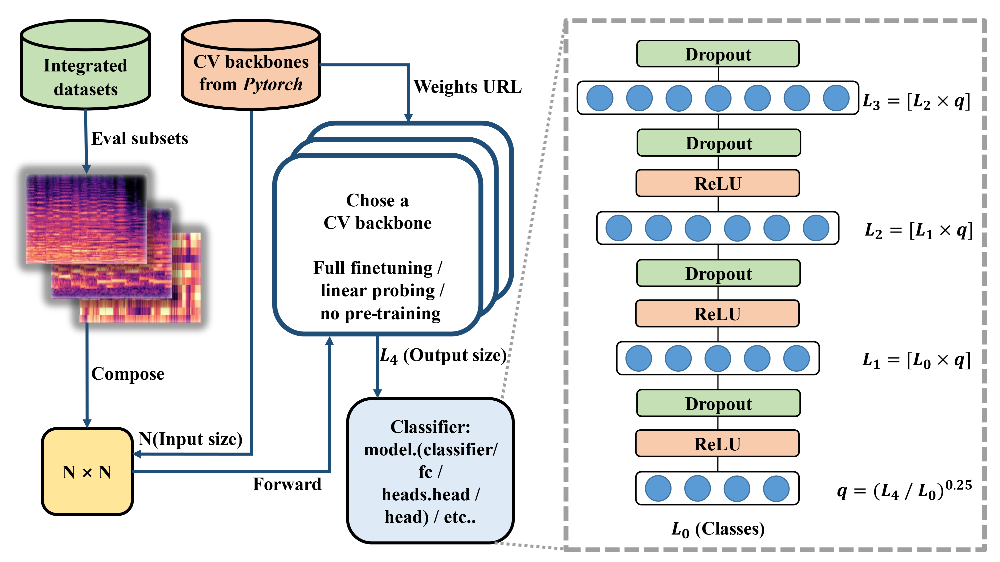

# Evaluation Framework for CCMusic Database Classification Tasks
[](https://github.com/monetjoe/ccmusic_eval/actions/workflows/python-app.yml)
[](https://github.com/monetjoe/ccmusic_eval/blob/main/LICENSE)

Classify spectrograms by fine-tuned pre-trained CNN models.



## Download
```bash
git clone git@github.com:monetjoe/ccmusic_eval.git
cd ccmusic_eval
```

## Requirements
### Conda + Pip
```bash
conda create -n cv --yes --file conda.txt
conda activate cv
pip install -r requirements.txt
```

### Pip only
```bash
pip install -r requirements.txt -i https://pypi.tuna.tsinghua.edu.cn/simple
pip install torch torchvision torchaudio -i https://pypi.tuna.tsinghua.edu.cn/simple
```

## Usage
```bash
python train.py --subset eval --data cqt --label singing_method --backbone squeezenet1_1 --focalloss True --fullfinetune False
```

## Supported backbones
<a href="https://www.modelscope.cn/datasets/monetjoe/cv_backbones/dataPeview">Mirror 1</a><br>
<a href="https://huggingface.co/datasets/monetjoe/cv_backbones">Mirror 2</a>

## Cite
```bibtex
@dataset{zhaorui_liu_2021_5676893,
  author       = {Monan Zhou, Shenyang Xu, Zhaorui Liu, Zhaowen Wang, Feng Yu, Wei Li and Baoqiang Han},
  title        = {CCMusic: an Open and Diverse Database for Chinese and General Music Information Retrieval Research},
  month        = {mar},
  year         = {2024},
  publisher    = {HuggingFace},
  version      = {1.2},
  url          = {https://huggingface.co/ccmusic-database}
}
```
